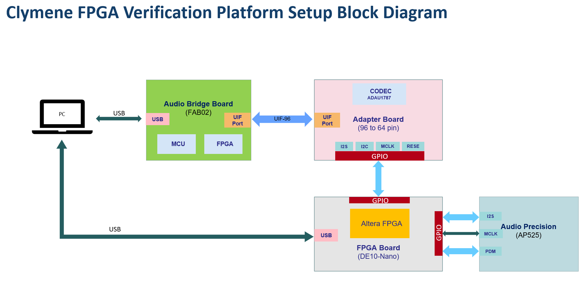
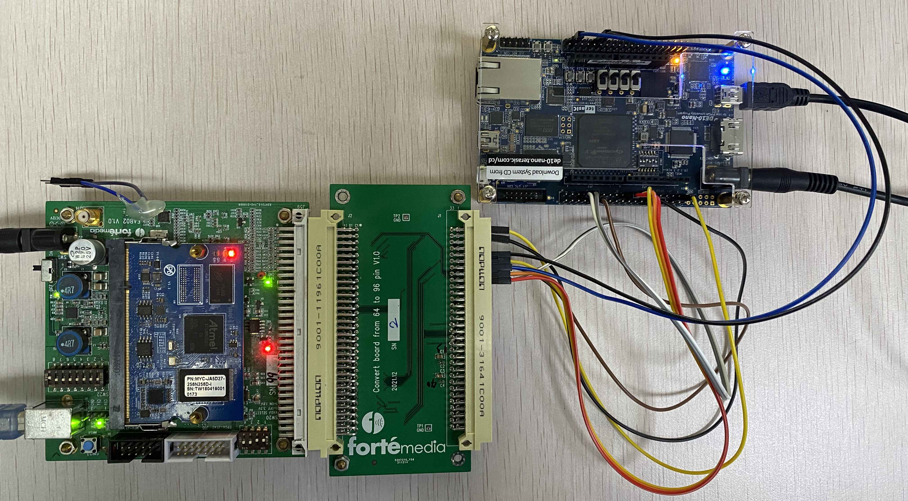
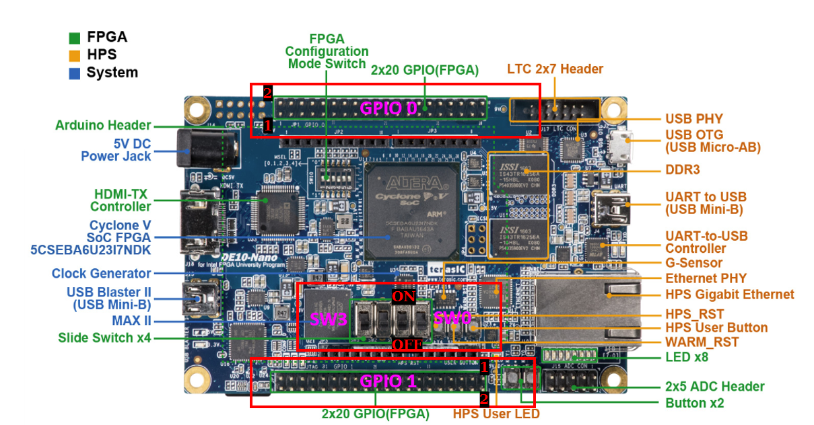
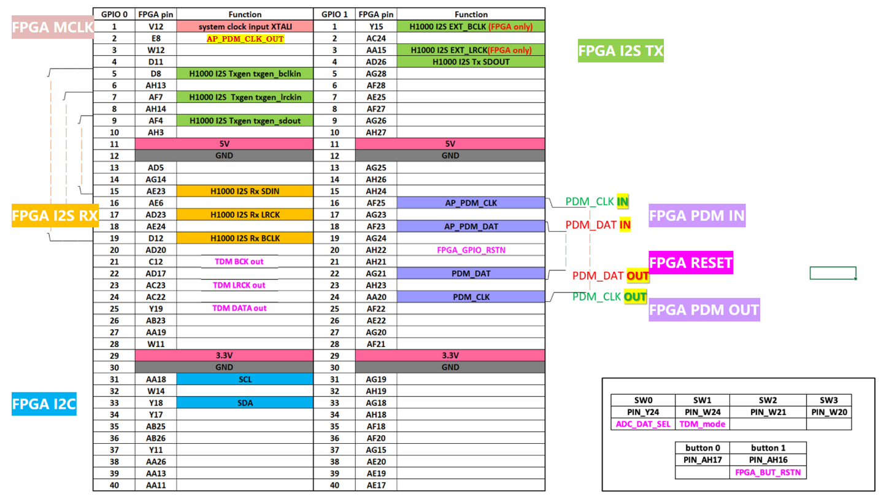
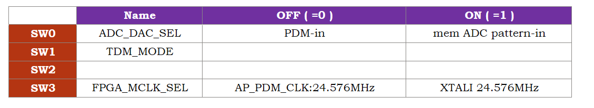
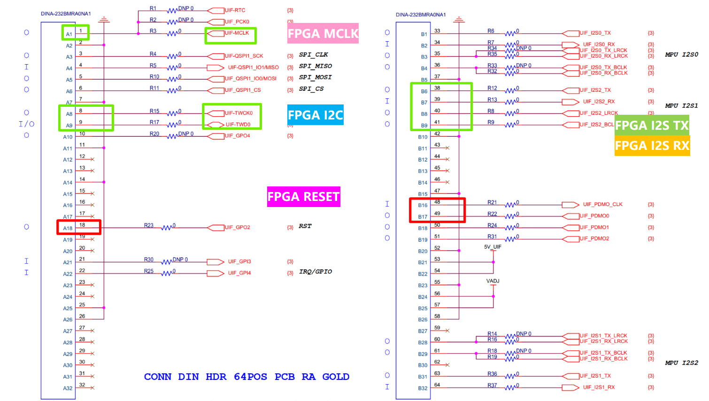
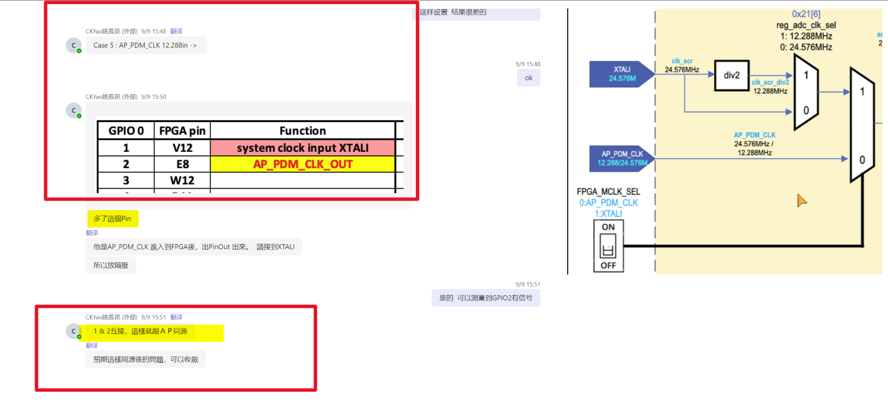

# Clymene (H1000) FPGA验证硬件连接设置

`2024/09/02` `10:49` *Released by* `PQ` [`Fortemedia`](https://www.fortemedia.com/ "Listen and sound better. Anywhere!") `SQA Tool Team` <a href="mailto:qiangp@fortemedia.com" title="Email the developer">📫</a> 

## 1. Overview

This is a guide on how to setup Clymeme FPGA verification platform based on DE1-Nano Dev Board, FAB02 Board and AP525.

## 2. System Block Diagram

 

 

## 3. DE10-Nano FPGA Dev Board

 

## 4. FPGA Dev Board上GPIO定义(20240830 Update) 

 

## 5. FPGA Dev Board上开关`SW0~SW3`定义

 

## 6. FAB02 UIF接口说明

 

## 7. 时钟源选择AP_PDM_CLK(SW3 OFF)时候，需要将 GPIO-0 的 `Pin1-2` 短接

 

